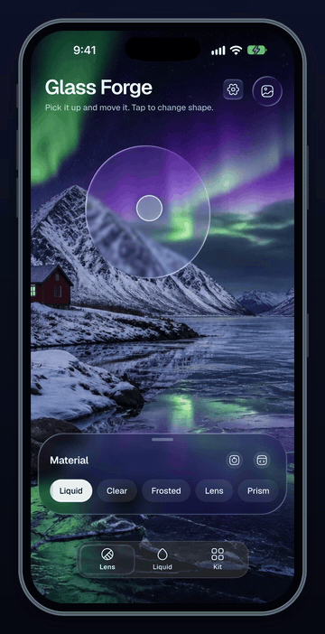
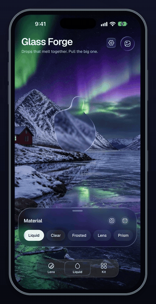
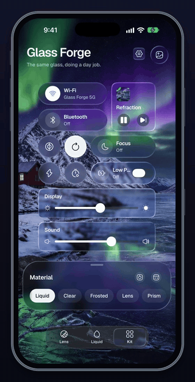
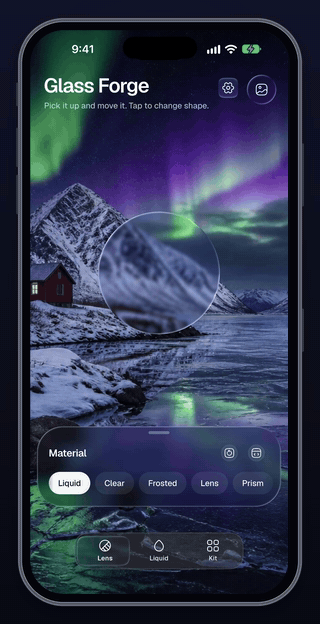
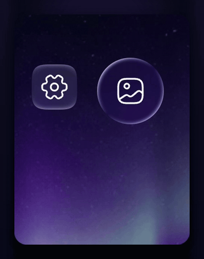
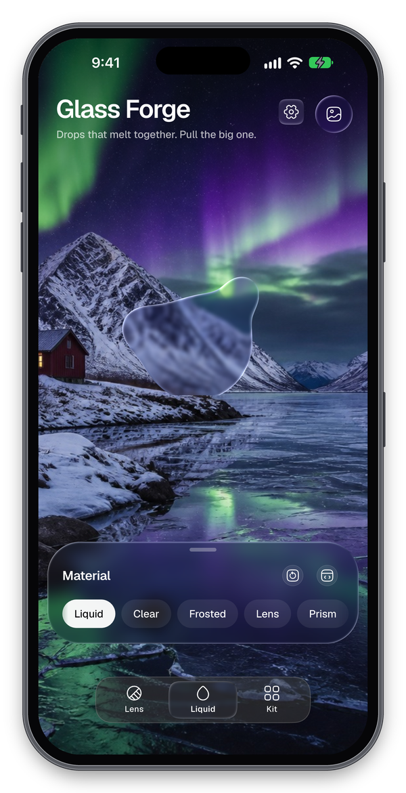
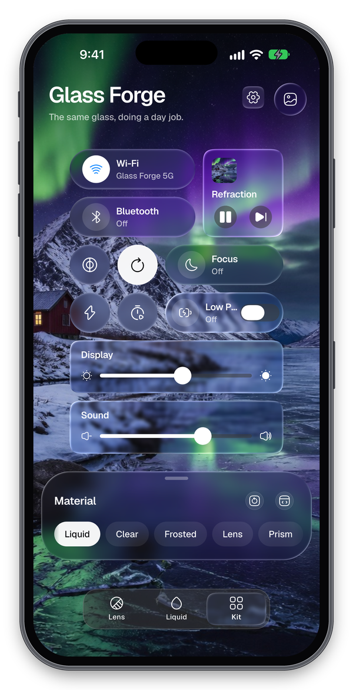
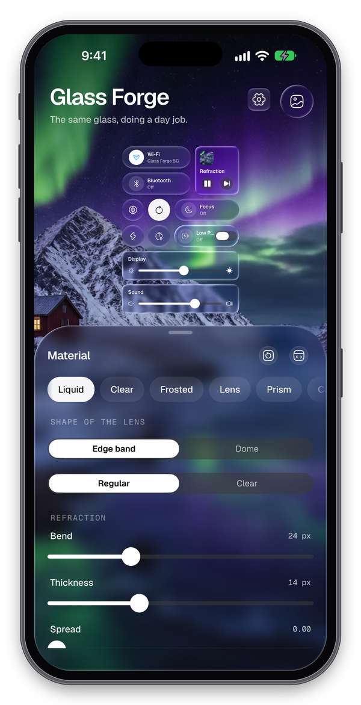
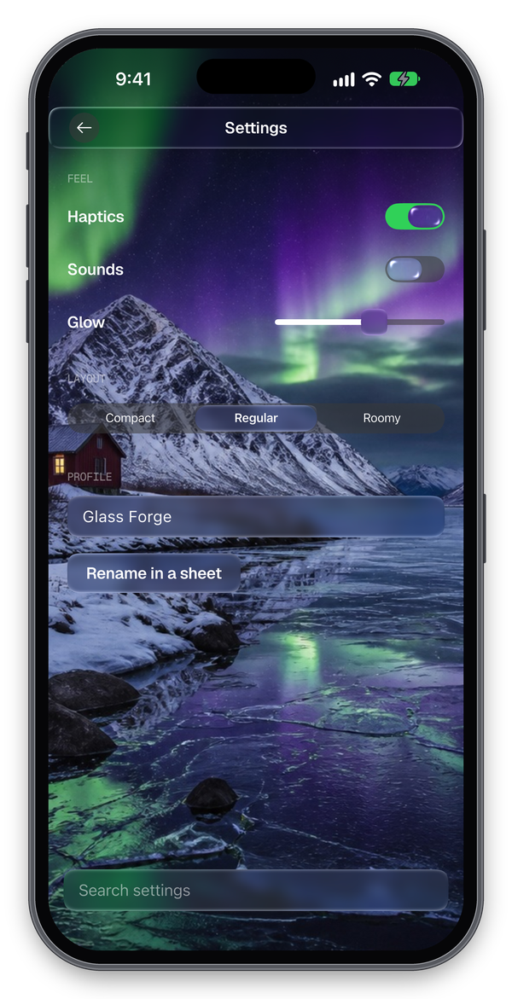
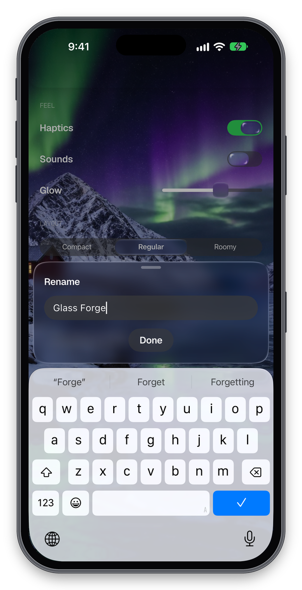

<p align="center">
  
</p>

<p align="center">
  
  
  
  
  
</p>

<p align="center">
  <strong>Liquid glass for Flutter — real refraction where the GPU allows, graceful degradation everywhere else.</strong>
</p>

<p align="center">
  <a href="https://github.com/Arhamss/glass-forge">GitHub</a> &nbsp;&bull;&nbsp; <a href="example/">Example app</a> &nbsp;&bull;&nbsp; <a href="CHANGELOG.md">Changelog</a> &nbsp;&bull;&nbsp; <a href="https://github.com/Arhamss/glass-forge/issues">Issues</a>
</p>

---

One package, one `pub add`. Rendering, tiering, motion, design tokens and the
native accessibility signals all live here, because a consumer should never
have to assemble a library themselves to get correct behaviour.

```dart
GlassLayer(
  material: GlassMaterial.regular(brightness: Brightness.dark),
  child: Stack(
    children: [
      const YourContent(),
      const Align(
        alignment: Alignment.bottomCenter,
        child: Glass(
          shape: GlassRoundedRectangle(
            radius: BorderRadius.all(Radius.circular(28)),
          ),
          child: SizedBox(height: 56, child: YourTabBar()),
        ),
      ),
    ],
  ),
)
```

## See it

Everything below is the [example app](example/), recorded on the iPhone 18
Pro Max simulator running Impeller. Nothing is mocked up: every frame is the
package rendering live.

<table>
  <tr>
    <td align="center" width="33%">
      <br>
      <b>Drops that melt</b><br>
      <sub>Shapes in a <code>GlassBlendGroup</code> smooth-min into one surface instead of overlapping.</sub>
    </td>
    <td align="center" width="33%">
      <br>
      <b>A day job</b><br>
      <sub><code>GlassButton</code>, <code>GlassSwitch</code> and <code>GlassSlider</code> on glass tiles, eleven shapes in one layer.</sub>
    </td>
    <td align="center" width="33%">
      <br>
      <b>Tuned live</b><br>
      <sub>Presets morph into one another; a <code>GlassDetentSheet</code> holds a knob for every field of <code>GlassMaterial</code>.</sub>
    </td>
  </tr>
</table>

<table>
  <tr>
    <td width="46%" align="center">
      
    </td>
    <td>
      <h3>Press, pull, let go</h3>
      <p>
        Pull a button and it gives the way native iOS glass does: about
        1.5&times; along the pull, the icon or label stretching with it,
        following the finger a few points. It lights up as it stretches and
        stays lit however far you drag. Let go and it springs back through
        rest with a soft bounce.
      </p>
      <p>
        All of it comes from one press spring, so the stretch, the sheen and
        the rebound can never fall out of step. Reduce Motion turns the
        movement off and keeps the response.
      </p>
    </td>
  </tr>
</table>

<table>
  <tr>
    <td align="center"><br><sub>Lens</sub></td>
    <td align="center"><br><sub>Liquid</sub></td>
    <td align="center"><br><sub>Kit</sub></td>
  </tr>
  <tr>
    <td align="center"><br><sub>Material sheet</sub></td>
    <td align="center"><br><sub><code>GlassScaffold</code> and <code>GlassAppBar</code></sub></td>
    <td align="center"><br><sub><code>showGlassSheet</code> over the keyboard</sub></td>
  </tr>
</table>

The example is a playground: three live scenes behind a `GlassTabBar`, under
a sheet with every field of `GlassMaterial`, presets, a quality-tier pin, and
a button that copies the material you end up with as Dart. Run it yourself:

```sh
cd example
flutter run
```

## How it works, in one paragraph

A `GlassLayer` captures the backdrop behind it once. Every `Glass` inside it
registers a shape into a shared signed-distance field, which is baked into a
compact RGBA8 **matte** — surface normal, edge distance and displacement
magnitude, one texel per pixel. Shapes far enough apart that their mattes
cannot meet are baked as separate clusters, so a material can carry any
number of them. A single `BackdropFilter` per material then reads that
matte and bends the captured backdrop along the normals, inside a
narrow band at each shape's edge. The interior is left undistorted, which is
what Apple's material does and what makes it read as glass rather than as a
lens.

That "one capture per layer" is a hard invariant, not an implementation
detail: a shader filter stacked *above* another backdrop filter reads a stale
previous-frame backdrop on physical iPhones ([flutter#187820]), which shows up
as a progressive white-wash.

[flutter#187820]: https://github.com/flutter/flutter/issues/187820

## Shapes and blending

`GlassRoundedRectangle`, `GlassOval` and `GlassSuperellipse` (Apple's
continuous-curvature squircle). Shapes in a `GlassBlendGroup` smooth-min into
one another in the distance field, so they merge like liquid rather than
overlapping like two cut-outs:

```dart
const GlassBlendGroup(
  blend: 24,
  child: Row(children: [Glass(shape: GlassOval()), Glass(shape: GlassOval())]),
)
```

Blend width is in logical pixels. Because the smooth-min is not associative,
registration order is load-bearing and is preserved deliberately.

## Motion

`InteractiveGlass` gives a surface press, drag, fling and spring-home, with
squash-and-stretch **derived from the spring's live velocity** rather than
animated as a separate channel — which is what keeps it physically coherent
instead of looking like a rectangle being scaled.

```dart
InteractiveGlass(
  drag: const GlassDrag(),
  settleMotion: const GlassMotion.smooth(),
  onTap: () {},
  child: const Glass(shape: GlassOval()),
)
```

A press grows the surface by 6 pt and lifts it with a soft glow; only a
finger that moves while pressing flexes it, by at most 5 %. Set
`pressScale` for a fixed ratio instead, or `GlassPressStretch.none()` to
keep the shape still.

Springs are specified the way Apple specifies them — **duration and bounce**,
not stiffness and damping. `GlassMotion.bouncy/.snappy/.smooth/.interactive`
cover the common cases.

This is built on [`motor`], with the gaps filled: `motor` has no decay
simulation (so `GlassDecay` wraps `FrictionSimulation`), no rubber-banding
despite a changelog entry claiming it (`GlassOverdrag`), no follow primitive
that avoids reallocating simulations per pointer event (`SpringAxis`), and no
reduce-motion handling at all — it stores an `AnimationBehavior` on every
controller and never reads it back.

[`motor`]: https://pub.dev/packages/motor

## Controls

`GlassButton` resolves `GlassSurfaceRole.control` for its material, shape and
label colour, and never draws glass on glass: built on content it is real
glass over `InteractiveGlass`; built under `GlassHostScope` — inside a glass
toolbar, say — it paints a flat tint with a scale on press instead. Its
glass draws the control role's material, not the enclosing layer's, so the
label colour is always tuned for the glass it sits on. The slider thumb and
the segmented pill do the same; the switch knob is always
`GlassMaterial.dome()`. All controls in one layer share that material's one
backdrop pass.

```dart
GlassButton(
  onPressed: () {},
  child: const Text('Continue'),
)
```

`onPressed: null` disables it. Every control in this package except
`GlassTextField` shares one frame for semantics, keyboard activation (Enter
and Space), a focus ring under keyboard focus, and a 44 × 44 minimum hit
target that grows the tap area, never the glass. The text field wraps
`EditableText` directly, because a tap there places the caret.

Every control takes `autofocus`, and all but the segmented control take a
`focusNode`. A disabled control dims its glass along with its paint. A
control moves the moment it is touched, then reports. If the owner does not
rebuild with the new value, the control goes back to the one it was given.
In a right-to-left layout the controls mirror the way Flutter's own do.
The switch's "on" side is on the left, and a slider's minimum is on the
right.

`GlassSwitch` is a track and a knob: the track is always painted — real
glass on a 63 × 28 capsule this thin reads as a smear, not a control — and
only the knob, the one lens-profile element Apple's own switch has, becomes
glass, and only on content.

```dart
GlassSwitch(
  value: enabled,
  onChanged: (next) => setState(() => enabled = next),
)
```

The knob drags, flicks and settles to whichever side it ends up past, on
the theme's `settle` spring; a tap toggles it outright.

`GlassSlider` is a painted track and fill under a thumb — real glass on
content, painted under `GlassHostScope` — that can be dragged from anywhere
in its 44-point-tall hit area, not only from the thumb itself.

```dart
GlassSlider(
  value: volume,
  onChanged: (next) => setState(() => volume = next),
)
```

The thumb stretches along the track under a fast drag, through
`GlassJiggle`; `divisions` snaps it to evenly spaced steps, and the arrow
keys step it by one division, or a tenth of the range without one.

`GlassSegmentedControl` is a row of mutually exclusive choices under a
travelling pill — real glass on content, painted under `GlassHostScope`.

```dart
GlassSegmentedControl<int>(
  segments: const [
    GlassSegment(value: 0, label: Text('Day')),
    GlassSegment(value: 1, label: Text('Week')),
    GlassSegment(value: 2, label: Text('Month')),
  ],
  selected: range,
  onChanged: (next) => setState(() => range = next),
)
```

The pill can be dragged from anywhere in the control, not only from the
pill itself, and snaps to the nearest segment on release; a tap on a
segment, or the arrow keys while one is focused, select it outright. Each
segment is its own semantics node — a selectable button, `isSelected` on
exactly the chosen one.

`GlassTextField` wraps `EditableText` — real glass on content, painted
under `GlassHostScope` — rather than reimplementing IME, composing text or
tap-to-place-caret handling.

```dart
GlassTextField(
  controller: controller,
  placeholder: 'Search',
  onChanged: (value) => print(value),
)
```

Focus reads as the glass lighting up: the material's highlight and tint
opacity animate brighter on the theme's `settle` spring, never a painted
ring on top. The brightening is a uniform on the field's backdrop pass,
driven the way `GlassPresence` drives a fade, so the animation rebakes
nothing. The caret and selection are painted above the glass as a
`Stack` sibling, never inside it, so they are never refracted, and a
focused field inside a scroll view calls `Scrollable.ensureVisible` to
track the keyboard's own show/hide animation clear of it. With no Material
ancestor required, the field shows the real system selection menu
(`SystemContextMenu`) wherever the device supports it — iOS 16 and
above — and nothing elsewhere by default; `contextMenuBuilder` and
`selectionControls` let an app that already imports Material or Cupertino
pass its own toolbar and drag handles in. Typing, arrow-key caret movement
and the platform's own copy/paste shortcuts all keep working regardless.

## Tiering

Glass is expensive, and the honest answer on a cold-throttled mid-range phone
is *less glass*. Wrap the app once:

```dart
GlassTierScope(child: MyApp())
```

The engine resolves a tier from four inputs: GPU capability, thermal state,
observed frame health, and the user's accessibility settings. Capability,
thermal and accessibility impose **absolute** ceilings — statements about the
device and the user. Frame health steps down **relatively** from wherever
those left it, because it is a statement about workload. So a strained frame
rate on a hot device lands lower than the same frame rate on a cool one.

`ResolvedTier.describe()` reports *why* the current tier was chosen, not just
which one it is.

| Tier | Renders |
|---|---|
| **full** | Everything: refraction, dispersion, specular, blending, and the dome lens |
| **balanced** | The dome without dispersion — 12 backdrop reads per fragment down to 4 |
| **reduced** | The lens flattens to Apple's edge band, keeping tint, saturation, frost and light |
| **flat** | No refraction: the frost, the tint and a contrasting border |
| **off** | Nothing is rendered at all |

Degradation is also the default when the renderer simply cannot run. On Skia
and the web backends `ui.ImageFilter.shader` throws, so the frost is applied
on its own and the refraction, rim and contour do not happen. You do not have
to opt in to that.

## Accessibility

- **Reduce Transparency** is read through a native channel, because Flutter's
  accessibility bitmask never reports it on iOS and Android has no public
  equivalent. When the platform cannot answer it returns `null`, and callers
  treat that as *unknown* rather than *off* — rendering full glass to someone
  who asked for less is the one failure worth engineering against.
- **Reduce Motion** honours both engine bits. `AccessibilityFeatures.reduceMotion`
  is documented as iOS-only and `disableAnimations` is what Android sets from
  its animator duration scale, so either alone is silently wrong on one
  platform.
- **Increase Contrast** drives surfaces toward near-opaque plus a border.

## Design system

Tokens (blur, radius, depth, tint ramps), five semantic surfaces, and theming:

```dart
GlassTheme(
  data: GlassThemeData.dark,
  child: GlassSurface.navigationBar(child: YourBar()),
)
```

Every tint step is the *minimum* opacity that clears its stated WCAG contrast
threshold over the worst backdrop in its scheme, and the tests assert both
directions — that it clears, and that slightly less does not.

Surfaces adapt by size, following Apple: small elements like a control flip
light/dark against their background, large ones like a sheet adapt without
flipping. The gate is thinness, not area.

What a surface adapts to is its `backdrop` colour. Pass one when you know
it; otherwise put a `GlassBackdropSampler` above the screen and mark the
content the glass sits on with `GlassBackdropSource`, and every surface,
control and bar beneath it is measured instead:

```dart
GlassBackdropSampler(
  child: Stack(
    children: [
      GlassBackdropSource(child: Image.asset('photo.jpg')),
      GlassLayer(child: GlassSurface.card(child: Text('Hello'))),
    ],
  ),
)
```

A backdrop filter cannot be read back, so the sampler snapshots the source
instead: at an eighth of its size, never more than 96 px on its long side,
at most every 200 ms and only after it repainted or something scrolled.
Both steps are asynchronous, so no frame waits. A reading has to move by
0.06 in luminance before a surface takes it up, so content scrolling past
the light/dark crossover does not make a bar flicker. An explicit
`backdrop` always wins.

The controls take their own colours from the theme too: the switch's
on-track (`accent`), the knob, thumb and pill painted on glass (`knob`),
the slider's fill and the focus ring (`fill`, `focus`, which default to the
label colour). The defaults are Apple's green and white; one override
recolours every control beneath it, and `GlassSwitch.activeTrackColor`
still wins for one switch. The chrome's painted colours live beside them
in `GlassTokens.chrome`: the sheet scrim (`scrim`, black at 32 %) and the
grab handle (`handle`, which defaults to the sheet's label colour).

```dart
GlassTheme(
  data: const GlassThemeData(
    tokens: GlassTokens(
      controls: GlassControlPalette(
        light: GlassControlColors(accent: Color(0xFF007AFF)),
        dark: GlassControlColors(accent: Color(0xFF0A84FF)),
      ),
    ),
  ),
  child: GlassSwitch(
    value: on,
    onChanged: (next) => setState(() => on = next),
  ),
)
```

Every `GlassSurface` constructor, `GlassAppBar`, `GlassDetentSheet` and
`showGlassSheet` take a `material` for an app with a
look of its own; null keeps the role's. A surface placed on glass paints
its tint instead of drawing a second glass.

## Chrome

`GlassScaffold` makes the composition rules the default instead of
something to get right by hand: your background and body paint behind the
bars, each bar is glass in a layer of its own clipped to the bar, and the
body gets padding back so a `ListView` clears the bars on its own. Glass in the body
(a switch in a settings list) shares one layer of the body's own, which
only draws glass between the bars: a control scrolled under a bar is cut
off at the bar's edge, never stacked under the bar's glass.

```dart
GlassScaffold(
  background: const ColoredBox(color: Color(0xFF101820)),
  topBar: const GlassAppBar(title: Text('Messages')),
  body: ListView(children: rows),
)
```

Each bar fades through its own presence, tied to the enclosing route: full
while nothing covers the screen, ramping to none as a sheet or another route
arrives over it, so the two are never both a backdrop filter over the same
pixels.

`GlassAppBar` is that top bar: a leading widget, a title centred iOS style
between it and the actions, and the top safe area built in.

```dart
GlassAppBar(
  leading: GlassButton.icon(
    onPressed: () {},
    icon: const Icon(Icons.arrow_back),
    semanticLabel: 'Back',
  ),
  title: const Text('Messages'),
  actions: [
    GlassButton.icon(
      onPressed: () {},
      icon: const Icon(Icons.search),
      semanticLabel: 'Search',
    ),
  ],
)
```

A `GlassButton.icon` action renders as paint, not a second sheet of glass
stacked on the bar's — every control in this package knows it is drawn on
glass through the same `GlassHostScope` this bar sets up for its children.

`GlassTabBar` is the bottom bar to put in it: a floating capsule with the
bottom safe area built in, one selectable button per tab. Only its
selection is glass. The bar itself is painted, a translucent capsule in
the navigation-bar tint with a hairline rim and no blur, so labels read
over any photo, the photo shows through for the lens to bend, and the
lens is never glass on glass.

```dart
GlassTabBar(
  tabs: const [
    GlassTab(icon: Icon(Icons.home_outlined), label: 'Home'),
    GlassTab(icon: Icon(Icons.search), label: 'Search'),
    GlassTab(icon: Icon(Icons.person_outline), label: 'Profile'),
  ],
  currentIndex: index,
  onTap: (next) => setState(() => index = next),
  // Optional: the bar's fill, and the lens's material.
  // backgroundColor: const Color(0xD91C1C1E),
  // selectionMaterial: GlassTabBar.defaultSelectionMaterial,
)
```

The selection is always a clear glass lens in a material of its own
(`selectionMaterial`). A bouncy spring moves it from tab to tab, and it
squashes along its travel, narrower and taller the faster it goes. Drag
along the bar and it follows your finger, with a click for each tab you
cross; lift and the tab under your finger is selected. It fades with the
bar, and under Reduce Motion it moves at once, still glass. Pass
`backgroundColor` to fill the bar yourself; the labels keep the role's
colour, so check them against it.
`GlassTabBar.height` and `GlassTabBar.margin` are public for laying out
content around the bar. On a wide screen the bar stays a centred capsule,
no wider than `maxWidth` (`GlassTabBar.defaultMaxWidth`, 480 points).

`showGlassSheet` presents a modal glass sheet from the bottom edge and
completes with whatever it is popped with.

```dart
final picked = await showGlassSheet<String>(
  context: context,
  builder: (context) => GlassButton(
    onPressed: () => Navigator.of(context).pop('done'),
    child: const Text('Done'),
  ),
);
```

It is a handoff, not a cross-fade: a `GlassScaffold`'s bars fade to nothing
in the first part of the sheet's arrival, and only then does the sheet's own
glass rise, so the two are never stacked filters over the same pixels. The
page beneath dims under a painted scrim. A scrim tap, a drag down or a fling
dismisses it unless `isDismissible` is false; Reduce Motion presents it
instantly.

## Presets

`GlassMaterial.regular(brightness:)` and `GlassMaterial.clear()` are fitted
against real iOS 27 captures. Those numbers are measured data — see
`lib/src/material/apple_presets.dart` for provenance — and are deliberately
not rounded to look tidy.

They are tuned for what Apple uses them for: a small navigation surface over
bright, content-rich material. They are not a good demo of refraction at
large sizes, where a lower tint and a narrower band read far better.

## Measuring it

`benchmark/run_scene_benchmarks.dart` runs 16 scenes, each varying exactly one
axis, and reports p50/p90/p99/worst rather than a mean. Budgets live in
`benchmark/budgets.json` so a change to them is a reviewable diff.

```
flutter run --profile -t benchmark/run_scene_benchmarks.dart
```

It refuses to gate on a debug-mode report. A debug build carries the full
assert overhead, so those numbers say nothing about shipped performance — the
harness marks such a run untrustworthy rather than letting it quietly pass.

## Status and known limits

- The budgets shipped in `benchmark/budgets.json` are **seed values, not
  measured data**. No profile-mode capture on real hardware has been taken
  yet.
- `kMaxShapes` (8) is a limit per cluster, not per material. Shapes whose
  mattes could meet, and every shape in one blend group, share a cluster.
  Past eight in one cluster the extras are not drawn, and a debug warning
  says so.
- `GlassSwitch` and `GlassSegmentedControl` dimensions are not yet measured
  against an iOS capture.
- `GlassBackdropSampler` sees a source repaint only when it reaches the
  source's own paint. An animation behind a repaint boundary of its own —
  a video, a platform view — needs `GlassBackdropSampler.markNeedsSample`.
  A surface that moves without anything repainting or scrolling keeps its
  last reading until something does.
- Where two materials' shapes overlap, the later pass samples the earlier
  one's glass. Apple's own guidance is not to stack glass on glass; put
  overlapping surfaces in one material or one blend group.
- `flutter test` cannot rasterise a backdrop filter faithfully, so rendering
  is verified on the Impeller lane
  (`flutter test --tags impeller --run-skipped --enable-impeller
  --enable-flutter-gpu -j 1`) rather than through `toImage()`.

## Requirements

Impeller for the refracting path; anything else degrades to blur. Flutter GPU
is used for the accelerated geometry producer where available and needs
`FLTEnableFlutterGPU` in `Info.plist` on iOS, or the
`io.flutter.embedding.android.EnableFlutterGPU` metadata key on Android.

## License

MIT — see [`LICENSE`](LICENSE).
